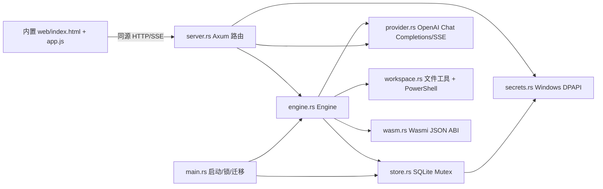

# 🍑sh harness 架构审计草稿

> 历史审计附录：以下代码事实记录于 schema 4 基线，不代表后续修复仍未完成。正式决策、优先级和实施顺序以 [项目重整方案](PROJECT-REORGANIZATION-2026-09-21.md) 和 [框架决策](FRAMEWORK-DECISION-2026-09-21.md) 为准。已确认的产品方向不再作为待答问题；修复状态须以对应测试与发布记录核对。

日期：2026-09-21  
审计范围：`rust-app` 的 Rust 核心、HTTP API、SQLite 持久化、内置网页、WASM 边界和测试结构。  
目的：为重新整理项目逻辑和目标提供事实基线；本文件只记录审计结论，没有修改业务代码。

## 审计结论

当前程序是一个**本机单进程模块化单体**：Axum 提供 HTTP 和 SSE，Tokio 负责任务协程，`Engine` 负责调度和工具循环，SQLite 保存配置/任务/事件，网页资源编译进二进制，WASM 只承担无 host import 的 JSON 转换。

这套结构适合“核心链路可运行的开发预览版”，但还不是目标中的“可持续开发、可恢复、可扩展的多模型 Agent Team 产品”。主要原因不是 Rust 或 WASM 本身，而是边界还没有分开：调度、模型调用、工具权限、文件恢复和数据库写入都集中在 `Engine`；任务状态以 JSON 大对象保存；前端和后端用名称约定推断会话类型；服务重启后的任务只能标记中断，不能由持久队列继续调度。

## 当前实际架构



### 启动和请求链路

1. `main.rs` 解析端口、数据目录、旧版目录和工作目录，创建实例锁。
2. `Store::open` 初始化/迁移 SQLite；没有设置时从旧版 YAML 只读导入。
3. `Engine::new` 创建共享 HTTP 客户端、全局并发信号量、按 Key 信号量和内存中的活动任务表。
4. `server::router` 暴露设置、路由检查、New API、运行组、任务继续/停止、SSE 事件和 WASM API。
5. `POST /api/runs` 在 `Engine` 中验证任务图、解析模型 Key、写入运行组，然后使用 `tokio::spawn` 启动每个任务。
6. 每个任务依次等待依赖、占用全局/Key 并发、请求 OpenAI 兼容流、执行模型工具调用，把 delta、状态和文件备份写入事件表。
7. 网页通过 `/api/runs/{id}/events` 轮询数据库并包装成 SSE；刷新后重新读取运行组。

### 模块职责和边界

| 模块 | 当前职责 | 主要问题 |
|---|---|---|
| `domain.rs` | 配置、路由、任务规格、运行组、路径/依赖校验 | 领域对象、默认值和传输结构混在一起；`kind` 由成员名称推断 |
| `engine.rs` | 配置变更、启动、依赖调度、并发、模型循环、工具调用、备份、恢复、停止 | 最大的耦合点；难以单测独立策略，错误处理和生命周期不集中 |
| `store.rs` | SQLite 建表/迁移、配置、Secret、运行组、任务 JSON、事件、恢复、旧版导入 | 同步数据库锁进入 async 热路径；核心状态全部 JSON 化；迁移依赖字符串扫描 |
| `provider.rs` | OpenAI Chat Completions、SSE 解码、模型列表、New API 余额 | 协议、重试、Key 健康、用量计费和余额来源没有抽象成 provider 能力 |
| `workspace.rs` | 路径边界、读写/搜索、PowerShell、WASM 工具 | “显式允许命令”仍是当前用户权限；没有独立审批/沙箱/工作树 |
| `server.rs` | 路由、鉴权头、错误转换、SSE、设置和账户接口 | API 契约没有版本和结构化错误码；SSE 存储错误被静默终止 |
| `wasm.rs` | manifest、哈希、fuel/内存、无 import JSON 运行 | 是安全的转换器边界，不是完整插件/MCP/宿主能力体系 |
| `secrets.rs` | Windows DPAPI 和日志脱敏 | 只有 Windows 持久化凭据；环境变量和旧密钥迁移策略仍分散在其他模块 |
| `web/` | 单页配置、聊天、团队和历史操作 | 前端以 `chat-session`、`team-summary` 等字符串承担业务协议，无法独立演进 |

## 明显问题（按优先级）

### P0：需要先固定的正确性和安全边界

1. **命令任务的冲突策略需要回归测试和重新命名。** 当前 `scope_conflicts` 实际上会在同项目存在活动任务时拒绝新命令任务，也会拒绝普通任务进入已有命令任务；但策略写在一个不直观的布尔条件中，容易被后续改动破坏。应把命令权限建模为项目级独占资源：同一工作区存在任意活动任务时，命令任务必须排队；有 worktree 时才允许并行，并补上先后提交的回归测试。
2. **任务收尾错误被吞掉。** `launch` 的最终 `save_task` 和状态事件使用 `let _ = ...`，数据库写失败时内存任务结束但持久状态仍可能是 running。应让状态转换进入带事务的 `TaskRepository::finish`，失败写入故障队列并可在启动检查中报告。
3. **HTTP 错误没有结构化分类。** `ApiError` 把所有错误返回 400；鉴权、上游超时、配置错误、任务不存在和内部数据库故障无法被客户端区分，也没有稳定错误码。应提供版本化错误对象（`code`, `message`, `retryable`, `details`）和 401/403/404/409/422/502/500 映射。
4. **SSE 存储错误静默断流。** `events` 流遇到数据库错误直接 `break`，前端看到的只是连接消失；应发送 error 事件并带最后游标，客户端可重连或提示恢复。
5. **命令执行没有操作系统级隔离。** 当前 PowerShell 继承当前用户权限；移除名字含 `KEY/TOKEN/SECRET` 的环境变量不能防止读取文件、网络、凭据管理器或启动其他进程。产品需要明确“本机受信模式”和“隔离模式”，并在 UI 显示风险；若要默认安全，必须接入 Windows Job/ACL/容器或仅允许白名单命令。
6. **设置和凭据更新不是一个原子操作。** New API 绑定先保存 `settings` 后写入账号 Secret；模型路由则先写 Secret 后保存 settings。任一步失败都会留下“有账号无令牌”或“有孤儿令牌”的半更新状态。应使用版本化配置事务/补偿清理，并在启动诊断中报告孤儿凭据。

### P1：阻碍扩展和连续开发的架构问题

1. **`Engine` 是不可分割的协调器。** 它同时处理任务图、状态机、资源租约、模型调用、工具执行、文件备份、脱敏和恢复。建议拆为 `RunService`、`Scheduler`、`AgentSession`、`ToolExecutor`、`ChangeJournal` 和 `CredentialResolver`，只通过领域事件通信。
2. **同步 SQLite 锁进入 Tokio 热路径。** `Store` 用 `Mutex<rusqlite::Connection>`，每个 delta、工具开始/结果和轮次都同步序列化。流式高频事件会阻塞 runtime，也让 SSE 与任务互相争用。保留 SQLite 可以，但应采用专用 DB actor（消息队列 + `spawn_blocking`）或 async SQLite；事件写入需要批处理/节流。
3. **任务和消息是 JSON 大对象。** `tasks.value` 保存整个 `Task`，每次 token/工具都重写完整消息数组；不能高效查询成员状态、用量、全文历史、分页和分支，也容易超过单行/上下文限制。建议把 `runs`、`tasks`、`messages`、`tool_calls`、`usage`、`checkpoints`、`events` 分表；消息正文可压缩或外置，事件保留游标。
4. **持久化队列不存在。** `tokio::spawn` 只在本进程内存中运行；重启时 `recover` 把 queued/running 标记 interrupted，用户必须手动继续。目标应记录可恢复的队列状态、租约、重试次数和取消原因，启动时由 scheduler 接管可重试任务。
5. **运行模式由名称推断。** `Run.kind` 在 `Engine` 中根据唯一成员名 `chat-session` 推断，网页也按该名称查找。名称是用户输入，容易出现错乱、迁移歧义和保留字碰撞。`RunRequest` 应显式带 `mode: chat | team | swarm`，成员使用 UUID，显示名只是不可用于路由的标签。
6. **团队调度是依赖图，不是完整 Team 协议。** 当前通过 `depends_on` 传递前置输出，成员之间没有消息、返工、选择性重派、预算或共享工件协议；`team-summary` 是前端拼出的特殊成员。应把“任务图”“成员消息”“交付物”和“汇总策略”定义成独立领域对象。
7. **Provider 只有一种协议实现。** `provider.rs` 固定 Chat Completions + SSE；没有 Responses/Anthropic/MCP 工具协议、上下文能力、错误分类、退避、Key 健康冷却、成本预算和模型路由策略。多 Key 现在只是按配置限流，尚未具备失败摘除和负载均衡。
8. **文件变更恢复不是完整检查点。** 只记录小于 256 KiB 的文本文件旧内容；命令造成的变更、删除/重命名、二进制和外部编辑无法纳入。恢复按最后一次备份覆盖，未检查用户在任务结束后是否再次修改文件。应提供基于工作树/git diff 的检查点和冲突检测。
9. **WASM 每次加载和编译。** `wasm::run` 先验证再创建 Engine/Module，缺少模块缓存、版本兼容矩阵、签名/来源、权限审计和插件安装/回滚。它适合作为纯函数扩展，不应被描述成已经迁移完整 DSH/MCP 插件生态。

### P2：产品和维护性缺口

- 只有全局一个 workspace 和一份 settings，没有项目实体、项目指令、worktree 和独立历史。
- 运行组列表固定最多 100 条，没有搜索、分页、归档、删除、导出或分支。
- API、事件和前端状态没有生成式类型/Schema；`app.js` 通过字符串和手工 JSON 拼装业务协议。
- 观测能力不足：没有结构化日志、请求 ID、任务耗时/排队时间、Key 命中率、成本和指标端点。
- 迁移逻辑把旧版导入、运行时 schema 迁移和历史会话识别放在一个 `Store::open` 中，缺少可预览、回滚和迁移报告。
- 测试覆盖了大量边界，但产品验收还应加入真实用户流程、升级/回退、异常网络、数据库损坏和并发写入的端到端场景。

## 建议的目标架构

```text
src/
  domain/       纯领域类型、状态机、策略和错误码（不依赖 Axum/SQLite）
  application/ RunService、ChatService、TeamService、CheckpointService
  scheduler/    持久队列、依赖图、资源租约、重试、取消和恢复
  agent/        AgentSession、上下文、工具调用、消息/工件协议
  providers/    Provider trait、OpenAI/Anthropic 适配、KeyPool、健康与预算
  tools/        文件、搜索、命令、Git、MCP/WASM；每个工具有权限声明
  workspace/    Project、Worktree、变更检查点和冲突检测
  persistence/  DB actor、迁移、Repository、事件/消息存储
  api/          版本化 HTTP/SSE/WebSocket、鉴权和错误映射
  extensions/   WASM manifest、签名、版本和 capability registry
  telemetry/    结构化日志、指标、审计和诊断
crates/protocol/ Host/UI 共用的 DTO、事件和错误码
crates/ui/      Rust/WASM 前端，按页面/状态拆分并共享 API schema
web-shell/      最小 WASM 加载器和迁移期 HTML 回退页
```

核心原则：

1. **Rust 宿主持有权限和生命周期，WASM 只拿到显式 capability。** 不把调度器和敏感工具搬进 WASM，以免权限边界、调试和升级变复杂。
2. **所有会改变状态的动作都经过领域状态机和事件。** HTTP、CLI、网页和后台恢复使用同一个 application service，不在前端拼特殊成员。
3. **调度是持久的。** 数据库记录 queued/running lease/retry/cancelled/completed，进程重启只恢复租约过期任务；模型流和工具结果以消息/事件追加保存。
4. **提供商是可替换能力。** `Provider` 暴露模型列表、流式完成、工具格式、上下文上限和计费；`KeyPool` 负责选择、限流、冷却、失效和成本预算。
5. **项目隔离优先于成员范围。** 每个运行组绑定 project/worktree；无 worktree 时命令任务获得项目独占租约，有 worktree 时可并行并在合并前验证。

## 分阶段重整计划

### 第 0 阶段：冻结协议和回答产品问题

- 引入 `RunMode`、`MemberId`、`ProjectId`、`ErrorCode`，移除通过名称识别 chat/team 的新代码路径。
- 写出 API/事件 JSON Schema，前端和测试都以 schema 校验。
- 先修命令任务冲突、状态收尾错误、SSE 错误传播和结构化 HTTP 错误。

### 第 1 阶段：拆出持久应用服务

- 把 SQLite 访问放入 DB actor/Repository；迁移为 runs/tasks/messages/tool_calls/checkpoints/events 表。
- `Scheduler` 只负责队列和资源租约，`AgentSession` 只负责一轮模型-工具循环。
- 启动时执行 lease recovery；为取消、重试、失败和继续建立明确状态转换。

### 第 2 阶段：多模型和 Team 产品化

- Provider trait + KeyPool 健康/冷却/预算；保留 OpenAI 兼容作为第一适配器。
- 任务图、成员消息、交付物和汇总策略分开；支持失败重派、运行中补充要求和结果引用。
- 项目、worktree、git diff/checkpoint 接入变更审阅。

### 第 3 阶段：工具和扩展边界

- 工具注册表统一声明 read/write/command/network 权限和审批策略。
- 命令隔离模式、Git 工作树和冲突检测；默认给 Agent 最小权限。
- WASM 模块缓存、签名、版本、安装/卸载/回滚；以后再按 capability 增加只读宿主 API。

### 第 4 阶段：产品和交付

- 前端拆分会话、团队、项目、审阅、设置页面，补搜索/分页/归档/导出和长对话压缩。
- 增加 E2E 用户路径、异常网络/升级回退、SQLite 备份恢复和诊断报告。
- 保持本机单用户默认；若要远程多人，再单独设计身份、租户和密钥隔离，不把本机 token 方案直接外推。

## 产品决策状态

已确认：Windows 优先的本机单用户；shared/worktree 由用户选择；Rust 核心与 Leptos CSR/WASM UI；项目范围内读取自动允许，写入/命令/按需网络逐次审批；Lead 先计划、用户确认后派工；健康 Key 选择、限流冷却和任务预算。协议 crate 先于界面迁移实现，WASM UI 不是可选的远期目标。

具体协议适配次序、命令的操作系统隔离实现、重启恢复策略和预算数值属于后续阶段设计事项。现阶段不因这些事项重问用户已经确认的方向；未批准或结果不明的副作用不得在重启后自动重放。系统权限保留在 Rust 宿主，既有纯 JSON 插件能力与浏览器 WASM UI 分开建模。
