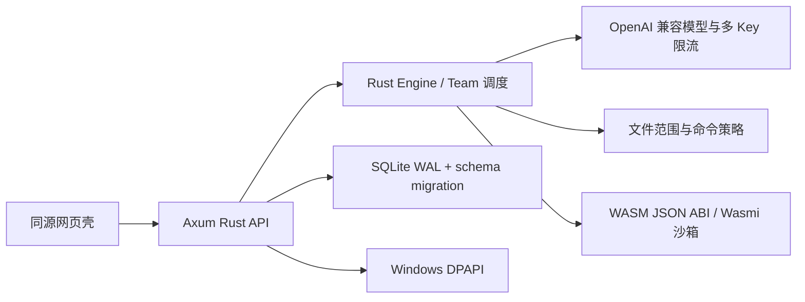

# 🍑sh harness Rust + WASM 架构论证

日期：2026-09-20

## 结论

DSH 适合重构为 **Rust 原生核心 + WASM 扩展层 + 轻量网页壳**。把所有代码一次性改成“100% Rust + 100% WASM”并不合理：操作系统权限、Windows DPAPI、SQLite WAL、HTTP 连接和进程生命周期都属于宿主能力，强行放进 WASM 会增加边界、降低可诊断性，并破坏已有会话与插件兼容性。

因此本版本把稳定性边界放在 Rust：调度、模型访问、凭据、数据库、文件权限和 HTTP 都在 Rust 内核中完成；WASM 只承担可替换、无副作用的 JSON 扩展；浏览器继续使用同源 HTML/CSS/JavaScript 壳。未来若有成熟的 WASM UI 工具链，可以替换网页壳，但不改变核心边界。

## 对“全部 WASM 化”的具体反驳

| 提议 | 结论 | 原因与替代方案 |
|---|---|---|
| 让调度器、数据库、HTTP、凭据全部运行在 WASM | 暂缓 | WASM 本身没有可信的文件、网络、DPAPI 或进程语义；每项能力都要重新设计宿主导入，结果比 Rust 原生边界更复杂。Rust 保留这些能力，WASM 只接收 JSON。 |
| 立即删除 Node/旧版运行时 | 暂缓 | 旧会话、插件、快捷命令和工作树界面不是稳定 WASM ABI；硬切会丢数据并阻断回滚。新版使用 `data-rust`，3080 旧服务保留到迁移完成。 |
| 让 WASM 插件直接读文件、访问网络或拿 Key | 拒绝 | 这会把插件变成凭据和工作区的越权入口。当前 ABI 禁止所有 module import，只开放固定 `run_json`，并限制模块大小、线性内存、fuel 和 SHA-256。 |
| 自动重试所有失败工具调用 | 拒绝 | 写文件、命令和外部 API 具有副作用，重试可能重复写入或重复扣费。当前仅保留事件和人工继续入口。 |
| 用一个 JSON Blob 永久保存所有状态 | 暂缓 | Blob 适合向前兼容，但无法高效索引和迁移。当前保留任务快照，同时用 SQLite 表、版本号和幂等键承载关键状态。 |
| 一开始就做完整 WASM UI | 暂缓 | 当前目标是先保证可用和可回退；浏览器壳体积小、无构建服务、兼容现有页面。WASM UI 作为后续独立迭代，不阻塞核心重构。 |

## 目标边界

稳定接口包括：

- `/api/runs` 支持 `Idempotency-Key`，同一键重复提交返回同一个运行组。
- `/api/wasm/plugins` 列出项目 `.peachsh/plugins` 中通过校验的扩展。
- `/api/wasm/run` 以 JSON 输入调用插件；Agent 工具名为 `run_wasm`。
- WASM ABI `peachsh.wasm.v1` 只要求 `memory`、`alloc(i32) -> i32`、`run_json(i32,i32) -> i64` 三个导出；返回值高 32 位是指针，低 32 位是长度。

## 当前安全限制

插件必须有 `manifest.json` 和 `plugin.wasm`，manifest 的 ABI、ID、能力、fuel、最大内存页和 SHA-256 都会校验。模块不能声明任何 import；单模块最多 8 MiB、4 MiB 线性内存，默认最多 5,000,000 fuel。输入和输出均为 JSON，单次最多 512 KiB。插件目录位于任务工作区，宿主不会把 Key、文件句柄、网络客户端或时钟注入插件。

## 迁移策略

旧版入口 `start-peachsh-legacy.cmd` 和 3080 服务保留为回退路径；Rust 入口 `start-peachsh.cmd` 使用 3090 和 `data-rust`。迁移完成的判据是：正式任务不再依赖旧插件调用链、所有需要的扩展有 WASM 版本、旧数据库完成只读归档并通过恢复演练。达到判据前不删除旧数据，也不自动改写旧会话。

