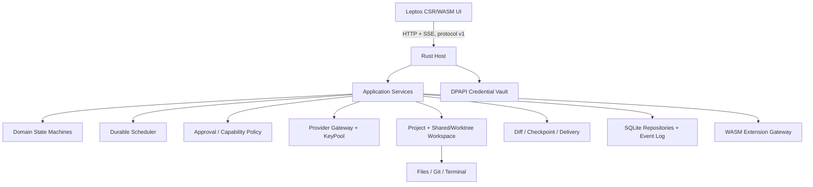

# 🍑sh harness 总体产品与架构基线

状态：**当前实施唯一主线**  
日期：2026-09-22  
目标平台：Windows 本机单用户  
产品名：🍑sh harness（后续简称 🍑sh）

旧的评估、迭代和参考文档保留作为历史证据；它们不能单独改变本基线。任何新功能都必须先归入本文件的领域、协议和验收流程，再修改代码。

## 1. 我们到底在做什么

🍑sh 是一个本机优先的 AI 编程工作台。它的主价值不是“能调用模型”，而是让用户可靠地完成一条开发闭环：

```text
选择项目 → 提出目标 → 读取代码 → 获得操作批准
→ 修改/运行测试 → 查看事实和 diff → 接受、恢复或继续
→ 重启后继续同一会话
```

多模型、多 Key 和 Agent Team 是这条闭环的加速层。它们不能破坏身份、权限、工作区、成本和结果可审阅性。

第一阶段不做远程多人 SaaS、租户系统、云端任务或跨主机协作。保留旧 Node/3080 入口作为迁移回退，直到新闭环完成验收。

## 2. 当前代码的事实基线

当前 `rust-app` 是一个可运行的 Rust 单体：Axum 提供本机 HTTP/SSE，`Engine` 包含调度和模型工具循环，SQLite 保存配置/任务 JSON/事件，DPAPI 保存密钥，Wasmi 执行无 import 的 JSON 插件，前端仍是内嵌 HTML/CSS/JavaScript。

当前已经具备：

- OpenAI Chat Completions 兼容流式调用、模型发现和手工多 Key 并发；
- 手工任务图、成员依赖、停止、继续、事件流、幂等创建；
- 受限文件读取/搜索/写入、PowerShell 命令、文件备份和基础恢复；
- Windows DPAPI 凭据、New API 账号余额查询、WASM JSON 扩展；
- chat/team 历史字段、旧配置导入、启动检查和测试夹具。

阶段 0 的首个改动已完成：新增 `crates/protocol`，定义 `SessionKind`、稳定错误码和错误响应形状；`RunRequest` 显式接收 `chat/plan/team`，Engine 和前端按字段路由，旧请求缺省为 team；新增测试证明任意成员名都不会改变会话类型。数据库已从 schema 4 迁移到 schema 5，旧的 `chat-session` 只在一次兼容迁移中解析并记录迁移标记；不存在的运行组现在返回 `404/not_found`，而不是把所有失败都伪装成参数错误。`plan` 目前只作为协议值保留，尚未允许直接派工。

当前**没有**实现，不能在文档或 UI 中伪称完成：

- 完整 Leptos/WASM 产品前端（目前只有 `crates/ui` 可编译迁移壳，旧 HTML/JS 仍是实际页面）；
- 持久化 Project/Session/Turn/Agent/Approval/Checkpoint 数据模型；
- Lead 计划确认后派工；
- 多 Key 健康池、冷却、失败摘除和真实预算；
- shared/worktree 产品化隔离、Git diff/合并；
- 逐次写入/命令/网络审批；
- 持久终端和后台进程；
- 持久队列、崩溃后自动恢复；（HTTP/SSE 已有第一版结构化错误码，但还没有完整的领域错误分类。）
- MCP/Skills/旧 DSH 插件兼容。

源码中仍有两个必须优先消除的旧耦合：`Run`/`Task` 同时承担会话和执行批次；旧数据启动迁移仍需扫描 `chat-session` 以兼容历史记录。新请求已经不再用名称推断；名称、职责、模型和 UUID 仍需在后续 Agent/Task 协议中彻底分开。

## 3. 目标架构：四个边界



### 3.1 UI 边界

采用 Leptos CSR：Rust UI 编译为浏览器 WASM，由 Axum 提供静态资源，通过共享 protocol 调用 API 和 SSE。现有 HTML/JS 只作为迁移期 fallback，不再增加业务功能。

浏览器 WASM 永远不能接触 Provider Key、New API 令牌、DPAPI 明文、文件系统、进程句柄或 SQLite。必要的 JavaScript 只用于浏览器绑定和 WASM loader，不改变 Rust 为主的 UI 目标。

### 3.2 Host 边界

Rust Host 独占系统权限和生命周期：数据库、凭据、HTTP Provider、文件、Git、命令、WASM 插件、任务队列和单实例锁。所有改变状态的入口（HTTP、UI、未来 CLI、恢复任务）都调用同一个应用服务，不能在前端拼接特殊成员名或绕过状态机。

### 3.3 扩展边界

UI WASM 与插件 WASM 是两件事。插件继续使用版本化 `peachsh.wasm.v1` JSON ABI、无 host import、fuel/内存/输入输出限制。MCP、Skills、网络工具未来通过 Rust capability gateway 接入，不因使用 WASM 就获得宿主权限。

### 3.4 持久化边界

SQLite 保留，但从“任务 JSON Blob + 事件”逐步迁移为可查询的 repository：

```text
projects
sessions (kind: chat | plan | team)
turns
agents (stable id, display name, role)
tasks (depends_on by id, status, workspace)
workspaces (shared | worktree | snapshot)
messages / tool_calls / approvals
artifacts / checkpoints / usage_records
providers / model_profiles / key_health
events / idempotency / migrations
secrets (DPAPI ciphertext only)
```

旧 `runs/tasks.value` 在迁移期继续读取，作为兼容投影；新代码不再把它当成长期领域模型。

## 4. 领域和状态机

### Project

项目是用户选择的本机目录，包含规则、Git 能力、默认工作区模式和 Provider 使用约束。一个实例可以有多个项目，但每个 Session 必须明确绑定一个 Project。

### Session

Session 是用户可见的连续上下文，类型明确为：

- `chat`：单 Agent 连续开发；
- `plan`：Lead 只分析、拆解和估算，不执行副作用；
- `team`：用户批准 plan 后的多 Agent 执行。

Session 类型由协议字段决定，不能由成员显示名决定。

### Agent 与 Task

Agent 有不可变 UUID、显示名、职责、模型能力、Key 池约束和权限策略。显示名可以改，但不能影响身份、消息路由、依赖或成本归属。

Task 引用 `agent_id` 和 `task_id`，依赖图只使用稳定 ID。Lead 产出的任务计划在用户确认前是草稿；确认后才创建可执行任务。

### Workspace

- `shared`：在用户当前项目目录执行；必须用冲突检查和命令独占租约保护；
- `worktree`：每个任务独立 Git worktree；完成后生成 diff 和合并候选；
- `snapshot`：仅用于只读分析或恢复演练。

用户明确选择模式。缺少 Git 前提时必须提示并停止，不得静默降级成 shared。

### ToolCall / Approval

读取项目范围内文件默认允许。写入、命令、额外网络、Git 合并、MCP 和可能产生外部副作用的工具逐次审批。批准绑定工具、参数、路径/命令、工作区和会话；参数改变、重定向超范围或审批过期必须重新批准。

命令当前仍可能以 Windows 当前用户权限运行，因此 UI 必须说明“审批不等于 OS 沙箱”。后续可加入 Job/ACL/白名单隔离，但在实现前不能宣称已隔离。

### 状态转换

```text
draft → awaiting_approval → queued → running
running → completed | failed | cancelled | interrupted
failed/interrupted → awaiting_resume → queued
completed → reviewing → accepted | restored | superseded
```

每次转换都写入事件和原因。数据库写失败不能被 `let _ = ...` 吞掉；SSE 存储错误必须发出可见 error 事件并携带最后游标。

## 5. Provider、Key 和预算

Provider Gateway 负责协议适配、模型能力、上下文限制、流式调用和错误分类。xpeach/OpenAI-compatible 是第一适配器；其他协议后续接入同一 trait，不让 UI 直接拼 Provider 请求。

KeyPool 的选择顺序：模型能力匹配 → 用户限制 → 健康度/冷却 → Key 并发和任务预算。鉴权失败、限流、暂时故障和余额不足分别记录；未知结果的副作用调用不能自动重放。

预算分为三类：请求/token/轮数等可测消耗、Key/账户余额、可靠计价后的金额预算。价格或币种未知时显示“未知”，不能伪造金额或把余额当成任务成本。第一阶段先限制 token、请求数、时间、并发和工具轮数；可靠价格接口确认后再启用金额硬上限。

## 6. 用户流程和产品放行

### P0：单 Agent 日常开发

用户从全新目录进入 → 配置 xpeach Key → 新建 Chat → 读/搜代码 → 请求写入和命令审批 → 运行长测试 → 查看逐文件/逐行 diff → 接受或恢复 → 关闭并重启 → 继续原 Session。

放行条件：失败保留草稿和部分输出；停止不会丢任务状态；事件断线可重连；不会重复写文件、命令或扣费；每次交付都有测试证据和可解释的恢复边界。

### P1：连续开发

上下文估算/压缩、项目规则、会话搜索分页、Provider 能力、Key 健康/冷却、预算、Git 分支和最小 MCP/Skills 闭环。

放行条件：重启、网络中断、限流、Key 失效、余额不足、旧配置迁移都能恢复或给出明确下一步。

### P2：异构 Team

用户目标 → Lead 生成计划 → 展示成员/模型/Key/工作区/预算 → 用户确认 → shared 或 worktree 派工 → 成员产出代码和测试证据 → Lead 汇总审阅 → 冲突解决/合并/重派。

放行条件：两个模型和两个 Key 能实际并行；成员身份不乱；一个成员失败可选择性重派；合并前独立测试；成本归属可追溯。

## 7. 从头实施顺序

### 阶段 0：协议和事实基线

1. 建立 Cargo workspace：`protocol`、`host`、`ui` 的边界先于功能扩张；
2. 定义 `SessionKind`、稳定 `AgentId/TaskId`、错误码、事件类型和 API v1；（`SessionKind` 与第一版错误码已落地。）
3. 新请求显式携带 chat/plan/team；旧数据只做一次兼容迁移；
4. 修复 schema/version 文档矛盾，补 v4→v5 迁移和名称变更回归测试；（已完成，迁移只执行一次并保留记录。）
5. 先建立 Leptos CSR 空壳和 protocol 编译验证，不宣称 UI 已迁移；（`crates/ui` 已以 Leptos 0.8.15 编译通过主机和 wasm32。）

### 阶段 1：真实开发闭环

按垂直切片交付：Project/Session → Chat/Turn → Approval/ToolCall → Patch/Diff → Checkpoint/Restore → Terminal → Leptos 对话和审阅页面。每个切片同时包含 Host、UI、迁移、失败测试和 E2E。

### 阶段 2：连续开发和交付

持久 Scheduler、DB actor/repositories、上下文压缩、KeyPool、预算、Git/worktree、MCP/Skills、迁移/备份/诊断。

### 阶段 3：Team 交付

Lead 计划确认、消息和工件协议、成员隔离、独立测试、合并/冲突/返工和可视化团队状态。

## 8. 测试门禁

每个阶段必须同时通过：

1. **领域单测**：状态转换、依赖、权限、ID、预算和迁移；
2. **Host 集成测试**：Provider mock、SSE 重连、取消、失败、幂等、数据库故障和恢复；
3. **安全测试**：凭据不泄漏、路径越界、错误 Host/Origin、审批绕过、Key 命名空间隔离；
4. **Leptos E2E**：浏览器从打开项目到接受/恢复和重启继续；
5. **真实 xpeach 手动门禁**：隔离 Key、小任务、双模型/双 Key、工具调用和脱敏记录；
6. **发布演练**：全新目录、升级、回退、旧数据迁移、单实例锁和 EXE 健康接口。

测试全绿不能替代产品流程验收；模型返回文本也不能代替测试和 diff 证据。

## 9. 文档和代码纪律

- 本文件是主基线；旧文件只能作为证据或专题附录；
- 每项实现必须标注：领域对象、API/事件变化、schema 迁移、权限影响、失败路径和验收测试；
- 当前实现、目标实现和未实现能力分开写；不把“有底层函数”写成“产品完成”；
- 不为兼容旧代码继续新增名称约定、全局 workspace 或不可审阅的整文件写入；
- 没有测试和实机证据的能力保持“计划中”。

## 10. 当前下一步

阶段 0 的协议、schema、结构化错误第一版和 Leptos 编译骨架已验证。下一步进入第一个垂直产品切片：把 Project/Session/Turn 的读取模型接入 Host，再将对话页从旧 HTML/JS 迁移到 `crates/ui`，同时保持回退入口，不同时重写 Team、Provider 和数据库。

专题材料：

- [框架决策](FRAMEWORK-DECISION-2026-09-21.md)
- [代码架构审计](ARCHITECTURE-AUDIT-DRAFT.md)
- [产品目标草案](GOAL-ROADMAP-DRAFT.md)
- [产品差距审计](PRODUCT-GAP-AUDIT-2026-09-20.md)
- [阶段 0 下一步审计](PHASE0-NEXT-AUDIT.md)
- [参考项目索引](../../references/REFERENCE-INDEX.md)
