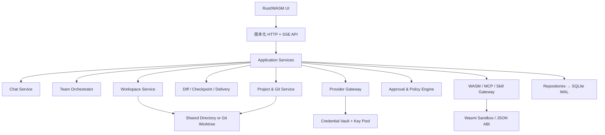

# 🍑sh harness 项目逻辑、目标与架构重整方案

日期：2026-09-21  
审计基线：Rust 0.2.0，SQLite schema 4；后续源码、正式实例与迁移版本分别记录，不能混称已部署。  
状态：产品方向已确认，实施基线已冻结；本文件描述目标，不代表全部功能已经实现。

## 1. 重新定义产品

🍑sh 不再以“把 DSH 的代码改成 Rust”作为完成标准，而定义为：

> 一个本机优先的开发代理工作台。用户在一个项目中通过对话提出目标，代理可以读代码、修改代码、运行验证、展示差异、接受或恢复修改；需要时由多个模型和多个 Key 组成 Agent Team 并行完成可审阅的子任务。

第一阶段只承诺本机单用户，不引入远程账号、租户、多人在线协作和云端任务。多 Key 是模型资源池，不是身份系统；Agent 的身份、权限、工作区和产物必须独立持久化。

## 2. 当前实现的真实边界

当前已经有一条可运行的技术链：

```text
网页壳 → Axum HTTP → Engine → OpenAI 兼容流式接口
                         ├→ 文件/搜索/命令工具
                         ├→ 依赖图与并发限制
                         ├→ SQLite 任务快照与事件
                         ├→ Windows DPAPI 凭据
                         └→ 无 import 的 WASM JSON 扩展
```

现有模块职责如下：

| 当前模块 | 现在承担的职责 | 主要问题 |
| --- | --- | --- |
| `domain.rs` | 配置、路由、成员、任务、运行组和校验 | `Run`、`Task`、会话、成员和一次模型回合混在同一层；展示名称仍参与依赖表达 |
| `engine.rs` | 调度、依赖、限流、模型调用、工具循环、备份、恢复和继续 | 业务编排过于集中，难以分别测试 Chat、Team、工具审批和工作区隔离 |
| `provider.rs` | Chat Completions、SSE、模型发现、New API 余额 | Provider、模型能力、凭据、用量和重试策略没有独立边界 |
| `store.rs` | SQLite 配置、密钥、任务 JSON、事件、幂等 | 关键状态仍以 JSON Blob 为主，项目、会话、回合、工具调用、检查点不可查询 |
| `workspace.rs` | 路径安全、读写、搜索、PowerShell | 共享目录与 worktree 没有产品级抽象；命令不是持久终端 |
| `wasm.rs` | WASM 清单、哈希、fuel、内存和 JSON ABI | 是受限扩展执行器，不是完整插件生态，也不是前端运行时 |
| `server.rs` | API、同源保护、SSE、静态资源 | API 仍按“运行组/任务”组织，没有 Project/Session/Turn/Approval/Checkpoint 资源 |
| `web/app.js` | 所有页面状态、渲染、SSE 和请求 | 单文件状态机；没有类型化 API 客户端、消息模型和变更审阅组件 |

已确认的维护问题：旧文档仍有 schema 2 的描述，而当前实现和正式实例已经是 schema 4；本次重整应把版本、迁移和验收记录统一到一个来源。

## 3. 目标架构

采用“Rust 宿主核心 + Rust/WASM 前端 + 可选 WASM 扩展”的边界。浏览器端 UI 编译为 WASM，通过版本化 HTTP/SSE 与宿主通信；WASM 扩展仍只运行显式声明、无宿主 import 的纯 JSON 能力。文件、进程、Git、网络、SQLite、DPAPI 和生命周期仍由 Rust 宿主负责。这样实现 Rust + WASM 前端目标，也不会把浏览器 WASM 或插件 WASM 伪装成系统权限层。



### 3.1 稳定领域对象

后续不再把所有概念塞进 `Run` 和 `Task`。目标对象如下：

| 对象 | 稳定含义 |
| --- | --- |
| `Project` | 一个本机项目目录、默认规则、Git 信息和工作区策略 |
| `Session` | 一段连续对话；可以是 `chat`、`plan` 或 `team` |
| `Turn` | 用户的一次输入及代理产生的模型/工具事件 |
| `Agent` | 稳定 UUID、显示名、角色、模型路由和权限；显示名不承担身份语义 |
| `Task` | Agent 在一次 Session 中要完成的工作项，依赖使用 `agent_id`/`task_id` |
| `Provider` | xpeach 或其他 OpenAI 兼容入口及协议能力 |
| `Credential` | Key、New API 账号令牌等机密引用，永不回传前端 |
| `ModelProfile` | 模型 ID、上下文、工具/视觉/推理能力和计价信息 |
| `Workspace` | shared、worktree 或快照目录；记录拥有者、路径和清理策略 |
| `ToolCall` | 模型请求、审批、执行、结果和副作用摘要 |
| `Artifact` | diff、测试报告、日志、文件列表或成员结构化结果 |
| `Checkpoint` | 可恢复的文件/Git 状态及不能回滚的外部副作用说明 |
| `Approval` | 用户对命令、写入、网络、MCP 等能力的一次决定 |
| `UsageRecord` | Provider、Key、模型、任务和 token/成本的可审计记录 |

其中 `Session` 是用户入口，`Run` 只能作为内部执行批次或兼容旧数据的投影；不能继续让一个特殊成员名 `chat-session` 决定页面路由。

### 3.2 分层代码结构

建议逐步调整为：

```text
rust-app/
  src/
    domain/         纯领域类型、状态机、校验、错误码
    application/    Chat、Team、Project、Review、Credential、Plugin 服务
    orchestration/  依赖图、调度、并发、取消、重试和事件发布
    ports/          Provider、Store、Workspace、Git、Terminal、Plugin trait
    adapters/
      provider/     OpenAI-compatible、xpeach、New API
      persistence/  SQLite repository 与 schema migration
      workspace/    shared、worktree、snapshot、命令会话
      plugins/      Wasmi、MCP、Skills 适配
      secrets/      DPAPI 与未来凭据后端
    http/           API DTO、认证、SSE、错误映射
    main.rs         启动、单实例锁、端口、配置和依赖注入
  crates/protocol/  Host/UI 共用的版本化 DTO、事件和错误码
  crates/ui/        Rust/WASM UI、状态机和组件
  web-shell/        最小加载器、CSP、WASM 资源和迁移期回退页
```

按小步迁移：先建立不依赖 UI 框架的 `crates/protocol`，显式声明 chat/team 并修正旧迁移的名称推断；再拆分 `Engine` 和应用服务，建立 Leptos CSR 的只读页面；随后按页面迁移对话、工作台、模型、余额和团队。每一步都保留旧 JSON 快照读取、schema migration 和当前 Web 壳回退入口。协议层可以先实现，选择 Leptos 不需要等待完整界面迁移。

前端选择 **Leptos CSR**：Rust UI 编译为浏览器 WASM，构建后的静态资源由现有 Axum 服务提供；通过 HTTP/SSE 调用宿主，第一阶段不引入 SSR。HTML、CSS、WASM 加载器及必要的 JavaScript 浏览器绑定仍然存在。具体版本和工具链在 UI 实现时核对并锁定。选择依据及 Dioxus 权衡见 [`FRAMEWORK-DECISION-2026-09-21.md`](FRAMEWORK-DECISION-2026-09-21.md)。

WASM 前端的硬边界：

- 不把任何 Provider Key、New API 令牌或 DPAPI 明文送到浏览器状态；前端只得到脱敏状态和一次性本机会话令牌。
- 不让浏览器 WASM 直接读本机文件或启动进程；所有工具执行都经 Rust API，并经过 Approval/Policy。
- 不让前端自行推断任务完成；状态以服务端事件和持久化结果为准。
- 迁移期同时提供 WASM UI 和 legacy Web UI，只有完整 E2E 通过后才切换默认入口。

## 4. 用户主流程

### 普通开发流程（P0）

```text
选择/创建 Project
  → 配置 xpeach Provider 和一个或多个 Key
  → 新建 Session
  → 对话提出目标
  → 代理搜索/读取代码
  → 请求写入、命令或网络能力时显示 Approval
  → 生成文件 diff 和测试结果
  → 用户接受、恢复或继续修改
  → 重启后从 Session 继续
```

### Team 流程（P1/P2）

```text
用户目标
  → Lead 生成计划、任务图和建议模型/预算
  → 用户选择 shared 或 worktree 隔离
  → 用户确认计划后，才创建和派发执行任务
  → 按能力/预算和 Key 健康度分配资源
  → Specialists 执行、发送结构化产物和测试证据
  → Lead 汇总并触发审阅
  → 冲突解决、独立验证、合并或选择性重派
```

Team 的身份必须由 UUID 和持久化成员记录判断；名称只是可编辑显示字段。`TEAM_NOT_MEMBER`、角色错乱、前台子代理第二步归属错误都要由身份/会话协议测试覆盖，而不是靠提示词修补。批准计划只授权已确认的派工范围；写文件、命令和按需网络工具仍逐次审批。计划改变目标、工作区或提高预算时，必须重新确认变更部分。

## 5. 要完成的目标与优先级

### P0：日常可用

1. Project/Session/Turn 数据模型和迁移，聊天不再依赖特殊成员名。
2. 完整对话闭环：Markdown、代码块、文件引用、停止、失败、重试、草稿、消息队列和 SSE 断线续传。
3. 精确搜索、按行读取、补丁写入、冲突检测、逐文件/逐行 diff。
4. Checkpoint、接受/恢复、命令和外部副作用边界说明。
5. 持久终端、后台进程、增量日志、取消和超过 30 秒的测试任务。
6. 项目切换、项目级规则和独立配置；凭据、命令、网络按能力审批。
7. 统一错误码、诊断页、安装/启动/迁移自检；修正文档与真实 schema/version 不一致。
8. 收紧执行可靠性：任务收尾写库失败不能被吞掉；SSE 数据库错误必须可见并可重连；HTTP 错误要区分鉴权、冲突、上游和内部故障；命令任务冲突策略要有先后提交回归测试；模型设置与 New API 凭据更新必须原子提交或可补偿。

P0 放行条件：新用户不手改文件即可打开项目，完成一次真实修复、运行长测试、查看 diff、接受或恢复，重启后继续；任何失败都不丢输入、不重复副作用。

### P1：连续开发与成本可控

1. 上下文估算、自动压缩、项目规则、记忆和会话搜索/分页/归档/导出。
2. Provider/ModelProfile 能力协商：协议、工具、视觉、推理强度、上下文和计价。
3. 多 Key 健康检查、限流冷却、熔断、失败重试策略和每任务预算。token、请求数、时间和并发限制可独立生效；金额预算须依赖明确计价、币种与用量，未知价格不能标成零费用或保证金额硬上限。账户余额仅是参考数据，不等同于任务成本。
4. Git 状态、分支、提交、冲突、变更交付和 worktree 生命周期。
5. MCP、Skills、Hooks 的最小闭环，全部经过权限、超时、取消和审计。
6. 旧 DSH 会话/配置的可恢复迁移，而不是只导入第一个模型。

### P2：异构 Agent Team

1. Lead 自动拆解、用户确认计划、模型池选择、并发槽位、预算和任务依赖。
2. 成员消息、运行中纠偏、失败重派、选择性重跑和结构化产物。
3. shared/worktree 由用户选择；worktree 成员独立测试，合并前自动验证。
4. Team 级 diff、测试门槛、合并/回滚和成本归属。

### P3：扩展与分发

WASM 插件索引/签名/安装/回滚、通知、定时任务、CLI/SDK、IDE 桥接、升级回退和远程协作。它们不能阻塞 P0/P1。Rust/WASM UI 是已确认的主界面目标，随第 1、2 轮逐页落地，不属于 P3 的可选项。

## 6. 三轮实施顺序

| 轮次 | 目标 | 关键输出 | 通过标准 |
| --- | --- | --- | --- |
| 0. 架构冻结与首批实现 | 先固定协议与类型迁移 | protocol crate、显式 chat/team、schema 5 修正名称推断迁移、兼容测试 | 旧数据可读；名称改动不改变显式类型；源码版本和部署版本分别记录 |
| 1. 产品闭环 | 单用户真实编码 | Chat/Project/Turn、逐次审批、补丁、diff、checkpoint、持久终端、重连、Leptos 对话与审阅页面 | 完成“打开项目→修复→长测试→审阅→接受/恢复→重启继续” |
| 2. 连续开发 | 稳定长期使用 | 上下文压缩、历史、Provider 能力、Key 健康/成本、Git、MCP/Skills | 多轮对话、重启、限流、余额不足、旧会话迁移均可解释和恢复 |
| 3. 异构团队 | 多模型多 Key 协作交付 | Lead 计划确认、worktree/shared、成员通信、测试/合并/返工 | 两种模型和两个 Key 并行完成子任务，各自验证并可合并；故意失败可重派 |

第 0 阶段首批改动不等于完整 Session/Agent 数据拆分，也不等于审批、Leptos UI 或健康 Key 池已经完成。上述能力必须按各自交付物和验收标准记录进度。

## 7. 需要立即修正的架构判断

- “Rust + WASM”不等于把数据库、网络、进程和凭据放进 WASM；这些能力留在 Rust 宿主才可审计和恢复。
- “多个 Key”不等于“自然形成团队”；团队需要身份、任务图、工作区、预算、结果契约和合并流程。
- “文件备份事件”不等于“变更审阅和恢复”；必须保存基线、当前 diff、接受/恢复结果和外部副作用。
- “模型返回完成”不等于“任务交付完成”；交付必须有测试、审阅和可定位的产物。
- “共享目录能运行”不等于“并行安全”；shared 是一种明确模式，worktree 是另一种明确模式，不能混合隐式切换。

## 8. 已确认的架构决策

| 决策 | 已冻结的范围 |
| --- | --- |
| 产品形态 | 本机单用户，Windows 优先；远程多人另行设计 |
| 工作区 | shared/worktree 两种模式由用户选择；不具备 Git 前提时说明 worktree 不可用，不静默换模式 |
| 前端 | Rust 核心 + Leptos CSR/WASM 前端；先 protocol，再逐页迁移；保留 legacy 回退 |
| 默认工具权限 | 项目范围内读取自动允许；写入、命令、按需网络逐次审批，由宿主执行校验 |
| Team | Lead 先生成计划，用户确认后才派工；成员仍遵守工具审批 |
| 多 Key | 启用健康度选择、限流冷却和任务预算，计价未知必须可见 |

“网络逐次审批”区分两类：配置模型时明确授权的模型端点属于该任务运行必需的连接；代理额外发起的网页、下载或其他网络工具需要单独批准。该区分必须在设置和计划中说明，不能借模型端点授权扩展为任意联网。普通命令审批也不是操作系统沙箱；在无法强制拦截命令网络/越界文件访问时，界面必须如实表明命令按当前用户权限运行，不能声称已实现网络隔离。

没有阻塞第 0 阶段的待确认项。后续具体预算数值、原生桌面封装、远程协作等按对应功能阶段再定，不重复询问已经确认的方向。

代码级事实和风险附录见 [`ARCHITECTURE-AUDIT-DRAFT.md`](ARCHITECTURE-AUDIT-DRAFT.md)；产品目标与测试门禁草案见 [`GOAL-ROADMAP-DRAFT.md`](GOAL-ROADMAP-DRAFT.md)。两份附录是审计材料，正式实施以本方案和你确认的产品决策为准。
