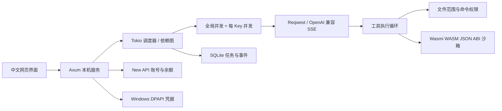

# NoHumanCode · Rust

2026-09-23 当前说明：开发目录为 ./；[项目书](../../PROJECT-BOOK.md)、[niuma 人员入口](../../niuma/README.md) 和[最新进度](../../niuma/项目经理/项目记录/PROJECT-PROGRESS-SUMMARY.md) 决定当前状态。以下运行说明和 2026-09-20 评估是旧实例快照。crate、EXE、数据库、协议及配置标识暂保留 peachsh 兼容，程序展示名称另由员工实施。


最新实机评估确认核心流程可用，但仍有 6 项待修缺陷，包含 2 项凭据隔离问题。详见 [运行评估与修复优先级](ASSESSMENT-LIVE-2026-09-20.md)。

这是独立运行的 Rust 核心版本，不再通过修改 DeepSeek Harness 的 node_modules 启动。HTTP 服务、流式模型调用、Agent 工具循环、Team/Swarm 调度、账号余额、凭据与会话存储均由 Rust 实现。当前实际产品页面仍是内置 HTML/CSS/JavaScript；`crates/ui` 已提供通过主机和 wasm32 编译的 Leptos 0.8.15 迁移壳，后续按垂直切片接入，不把空壳称为完整迁移。

## 运行

双击 `./.local/legacy-instance/start-peachsh.cmd`。默认地址为 `http://127.0.0.1:3090/`，避开旧版的 3080 端口。旧版入口是 `start-peachsh-legacy.cmd`。

程序：`./.local/legacy-instance/bin\peachsh.exe`。

```powershell
./.local/legacy-instance/start-peachsh.cmd --port 3091
./.local/legacy-instance/bin\peachsh.exe --data-dir ./.local/legacy-instance/data-rust --check
```

首次启动从旧版 `data/settings.yaml` 导入模型路由，并读取已经存在的凭据及 New API 账号配置。导入为只读，不覆盖旧文件。此后新版设置独立保存于 `data-rust/peachsh.sqlite3`，不会随旧版配置修改而自动同步。

如果 Key 仅在之前的连通测试中临时使用，没有保存到旧配置，新版也不会自动保存它。在“模型与 Key”页面输入后保存即可。环境变量的优先级高于保存的 Key。

## 已实现

- Rust 原生对话页：固定模型路由、流式回复、连续续聊；历史记录中的对话任务刷新后仍可重新进入。
- 单模型流式对话、多个独立 Key / 模型的并行任务。
- UUID 成员身份与显示名称、职责、模型分离；继续任务保留原始路由快照。
- 总并发 1–8，每个 Key 单独限流；多个路由使用同一 Key 时共用限制，采用较小的配置值。
- 前置依赖组成无环任务图；前置成功后自动传递结果，失败则阻止下游执行。
- 可选团队汇总成员，等待全部前置成员完成后汇总；不会自己声称已运行测试。
- 项目工具：列目录、读文件、按范围写文件、显式开启的 PowerShell 命令。
- 写入范围冲突检查，包括不同任务组；有先后依赖的成员可以依次写同一范围。
- 任务停止、持久事件、刷新重连、进程异常退出后的中断恢复。
- SQLite WAL 持久化，Windows DPAPI 加密保存 Key；不经网页 API 回传 Key。
- New API `/api/user/self` 账号验证、余额和已用额度，换算比例可配置。
- 启动环境诊断、端口冲突提示、同一数据目录单实例锁。
- WASM 扩展沙箱：固定 `peachsh.wasm.v1` JSON ABI、SHA-256 校验、fuel/内存/输入输出上限；Agent 工具名为 `run_wasm`。
- `POST /api/runs` 支持 `Idempotency-Key`，重复提交不会创建重复运行组；数据库 schema 当前为 5，旧版数据库会执行一次可追踪的兼容迁移。

## 开发工作流

1. 在“模型与 Key”中设置项目目录和 API 地址。xpeach 使用 `https://xpeach.codes/v1`；真实模型名为 `gpt-5.6-sol`、`gpt-6-astra`。点击“获取模型”以当前账号返回值为准。
2. 新建任务，填写每位成员的固定名称、职责、路由与任务。名称使用小写英文、数字和连字符。
3. 开启项目工具时，空写入范围表示只读；例如 `src/api, tests/api` 表示这些路径可以修改。
4. 需要顺序开发时填写前置成员名称。比如 `developer` 的前置是 `planner`，`reviewer` 的前置是 `developer`。
5. 任务详情展示实际模型、状态、输出和工具记录。完成、失败或中断的成员都可以继续。

文件工具拒绝 `..`、绝对路径、Windows 设备路径、目录联接/符号链接及常见敏感文件。文件替换前，旧内容记录在任务事件表中。此限制仅适用于内置文件工具，不是操作系统沙箱。勾选命令执行后，PowerShell 具备当前用户权限；因此命令任务必须单独启动，且同项目有其他活动任务时会拒绝。命令最多运行 30 秒，输出最多保留各 64 KiB。文件工具单文件上限 256 KiB。

New API 的账号令牌与模型调用 Key 不同。默认额度换算为 quota / 500000，具体单位以站点设置为准，界面不将它擅自标记为货币。

## 架构

项目的当前实现边界、统一领域模型、实施顺序和验收门禁以 [`总体产品与架构基线`](MASTER-ARCHITECTURE-BASELINE-2026-09-22.md) 为准。前一阶段的评估和重整文档只作为专题审计；本 README 只记录已经发布的实现。



| 模块 | 职责 |
|---|---|
| `domain.rs` | 配置、成员和任务类型、名称/路径/依赖校验 |
| `engine.rs` | 并发、前置任务、工具循环、停止与继续 |
| `provider.rs` | OpenAI 兼容流、工具参数拼接、模型发现、余额 |
| `store.rs` | SQLite 事务、事件游标、恢复、旧配置导入 |
| `workspace.rs` | 项目文件读写、范围校验、PowerShell 执行 |
| `wasm.rs` | WASM manifest、SHA-256、fuel/内存限制和 JSON ABI |
| `secrets.rs` | DPAPI 加解密和错误脱敏 |
| `server.rs` | HTTP API、SSE、同源与请求令牌检查 |
| `web/` | 内嵌网页，不含构建依赖 |

## 构建与验证

从仓库根进入现行工作目录 `./NoManCode/rust-app`；本节用于当前源码，前面的旧部署实例说明继续按历史阅读。环境差异与只读接手检查见 [环境与验证](../../niuma/项目经理/环境与验证.md)。

```powershell
Set-Location -LiteralPath './NoManCode/rust-app'
.\build.ps1 -Action test
.\build.ps1 -Action clippy
.\build.ps1 -Action build
.\build.ps1 -Action wasm-check
```

`Cargo.lock` 固定依赖版本。`rust-toolchain.toml` 同时声明 `wasm32-unknown-unknown`；`build.ps1` 识别这台机器已有的 Visual C++ 与 Windows SDK。2026-09-23 在本工程目录核对 Rust stable 为 1.98.1；总根目录默认工具链是 1.82.0，执行前必须进入上述目录。首次缺依赖的构建可能下载 crates。用户运行已编译的 EXE 不需要 Rust 工具链。

本地测试使用模拟上游覆盖：分 Key 并发与路由、身份恢复、依赖顺序/环检测、文件工具、冲突拒绝、停止、配置锁、崩溃输出恢复、流式 UTF-8 分块/工具调用、截断响应、凭据加密、New API 额度与本机 HTTP 边界。

真实模型测试默认忽略，避免常规测试扣费。显式设置进程环境变量 `PEACHSH_TEST_KEY` 后执行 `build.ps1 -Action live`，会做两个算术请求和一个临时文件写入/读取任务。密钥不会保存，临时文件会清理。

## 迁移边界

当前版本实现的是独立核心工作流，并非 DeepSeek Harness 全部插件的一比一移植。Rust 对话页、工作台、Team/Swarm 任务和余额页面已经可用；旧会话历史、插件/Skill/MCP 生态、原版快捷命令和复杂工作树界面尚未迁移，仍可从旧版查看和使用。原版 `TEAM_NOT_MEMBER` 所属的插件调用链不再用于 Rust 任务，Rust 任务采用自己的固定成员记录与路由。完整取舍和反驳见 [`ARCHITECTURE-REBUTTAL.md`](ARCHITECTURE-REBUTTAL.md)，三轮验收见 [`ITERATION-PLAN.md`](ITERATION-PLAN.md)，最新全面评估见 [`EVALUATION-2026-09-20.md`](EVALUATION-2026-09-20.md)。

目前只实现 OpenAI Chat Completions 兼容协议；不自动切换模型，不在有副作用的工具执行后自动重试。上游中断或达到轮数/上下文限制时，保留错误与结果，由用户检查后继续。暂未实现自动上下文压缩、跨主机协作、后台自动重启、任务删除或幂等键过期清理；数据库已具备基础版本迁移边界。

旧版会话保持在 `data`，新版在 `data-rust`。备份数据库前先停止对应实例，或使用 SQLite 的在线备份能力；不要仅复制仍在写入的主库而漏掉 WAL。项目级 WASM 插件示例和 ABI 说明见 [`examples/wasm-echo/README.md`](examples/wasm-echo/README.md)。
