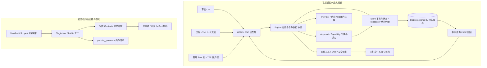

# 第二轮整体架构总结

整理日期：2026-09-26。整理人：项目经理 GPT-6。依据已验收源码、员工报告、经理review和Git整合记录整理；本次只读核对与文档总结，未重新运行产品测试，未修改产品源码或派发新实现任务。

**阶段结论：在第一轮会话、持久化与HTTP/SSE基础之上，已经补齐逐次审批、执行事实持久化、审批HTTP/CLI，以及文件变更与安全恢复的后端链路；插件声明目录和builtin生命周期也有独立验收的实现。完整CLI开发工作台、插件统一接管业务能力、Git Diff/Checkpoint和Desktop仍未完成。**

## 1. 总结口径与版本边界

本篇按用户要求，将[第一轮总结](第一轮工作总结与员工分工.md)之后、截至本次Workspace验收的整体开发阶段称为“第二轮”。这不是对员工各自“第二轮/第三轮/第五轮”档案重新编号，也不是项目书的“阶段二：Desktop”。个人轮次、任务ID、历史贡献和验收范围均保持原事实。

覆盖：NEXT-01新增Turn HTTP、NEXT-02A插件目录、NEXT-02B builtin Host、NEXT-02C审批网关、NEXT-02D审批HTTP、NEXT-04A审批CLI、NEXT-03A文件变更与安全恢复。最后两项有并行开发和先后整合，不按编号推断时间顺序。

总结基于主线 **`50a04d8298db710912b0cf646f9c13fb5329dd27`**；最后产品整合 **`9d78987897b8a1278e3a55667275df4b5e658cf1`**；受测组合 **`5c5fcb6ef15398c7f01967e5805a4fd2a144961c`**。三者Rust源码树相同：**`0d493bb20ba0c16e79dee2ee9693de394897bad9`**。本总结后续提交仅改变文档，不改变上述产品验证锚点。

## 2. 当前实际架构

图中不把插件基础画成生产工具的必经路径：当前main创建Store、Engine和HTTP服务，Engine仍直接调用Provider/workspace；源码中PluginHost尚未被这条启动和执行链实例化。插件目录与Host已有公开库和测试，尚不能据此宣称所有工具都已插件化。

传输层负责请求、安全DTO和错误映射；Engine负责“是否执行、何时执行、如何协调”；Store/Repository负责事务、不变量和持久事实；操作系统副作用由文件/命令层执行。审批决定不直接变成文件写入，浏览器和审批CLI也不直接打开SQLite或持有模型Key。

## 3. 按架构层看本轮增量

| 架构层 | 第一轮结束时 | 本阶段新增并已验收 | 当前边界 |
| --- | --- | --- | --- |
| 领域与持久化 | 稳定Project/Session/Agent/Turn/Task，schema6、幂等、事件和旧投影 | schema7 approvals；schema8 changes/restores/outcomes；决定、执行、变更和恢复事实分离；保全迁移与真实结构检查 | 旧Run/Task兼容投影仍在；不是一次性替换旧数据模型 |
| 应用服务 | 已有无工具单Agent连续Turn命令和旧工具执行循环 | 审批等待/唤醒、持久claim、结果提交、取消竞争、未知结果保护；write_file变更跟踪与restore协调 | 新send_chat_turn仍限已有单Agent无工具历史；带工具任务走既有start/run_task/resume链 |
| 权限与审批 | tools/write_scopes/allow_commands静态限制 | task+call隔离的逐次批准，参数/工具/任务/工作区/权限绑定及执行前重核；未知工具默认拒绝 | 当前工具分类策略，不是完整动态Capability租约、第三方插件授权或全网络策略系统 |
| HTTP / SSE | 已有读取、创建、游标回放和错误边界 | 新Turn POST，审批三路由，安全changes/restore DTO和partial/unknown回执 | 复用现有SSE；决定路由只持久决定和通知，不直接执行工具 |
| Workspace | 文件工具和旧备份式恢复基础 | DPAPI before、准备/完成/未知、首次before聚合、冲突预检、稳定restore_id、幂等和真实中断恢复 | 普通文件字节/存在性；不是Git Diff、目录checkpoint或Shell回滚 |
| 插件系统 | 既有隔离WASM工具；完整Host基础待补 | 纯声明Catalog、确定性依赖计划；builtin Context、绑定、effect所有权和可撤销生命周期 | 纯内存builtin；未接生产Engine、WASM/process统一运行时或生命周期持久化 |
| CLI与前端 | 服务启动入口、旧网页、Leptos壳 | 审批查询/批准/拒绝CLI；旧网页变更摘要与complete提示适配 | CLI还不能完成create/send/status/events/resume/Workspace全流程；Desktop和审批卡片未交付 |
| Provider与凭据 | 路由、模型发现/流式调用、DPAPI/环境变量Key和并发基础 | 复用于上述真实链路，并强化审批结果/事件的安全持久化边界 | 本轮未交付Provider插件化、预算账本、高级KeyPool或通用网络审批 |

## 4. 应用执行：两条业务链仍需区分

**连续消息链：** `POST /api/sessions/{id}/turns → Engine::send_chat_turn → Store::append_chat_turn → 提交新Turn/Task与事件 → 后台执行 → Session SSE`。严格body与必填单值Idempotency-Key；首次201、同请求回放200。回放不再派发Provider；竞争和前序状态冲突明确拒绝。当前只接受已有单Agent无工具会话，不把工具历史强塞进该切片。

**工具任务链：** `start / resume → run_task → Provider返回tool_call → 权限分类 → 审批 → claim → perform_tool → 完成事务`。文件写入和命令执行在这条实际业务链中受控。已有任务依赖执行可复用，但不能因此声称持久Scheduler或完整Team编排已经完成。

这个划分保留了第一轮的稳定连续消息语义，同时给旧工具循环补上审批与恢复。下一阶段若要统一两条链，须明确工具历史如何进入新Turn、幂等与恢复如何保持；不能只改HTTP路由或前端调用就宣布统一。

## 5. 审批架构：用户决定与执行事实分开

审批记录按 **task_id + tool_call_id** 定位，同任务新调用重复ID在副作用前拒绝；不同任务可以有各自独立调用ID。绑定摘要覆盖tool、规范参数、task/session/turn、workspace、write_scopes与allow_commands，批准后的执行仍重新核对。

| 维度 | 主要状态 | 表达什么 |
| --- | --- | --- |
| 审批决定 | pending / approved / denied / cancelled | 用户是否授予这一次调用执行许可 |
| 执行事实 | not_started / claimed / finished / unknown / cancelled | 是否取得执行权、是否已提交可信结果 |

批准不等于已执行，finished也不等于工具业务成功：工具返回安全错误同样可以作为一次已结束的执行事实。执行前先以事务和条件更新持久claim；执行后再把安全结果、工具消息、任务投影、事件和finished一起提交。决定/取消的竞争也由事务与条件更新裁决，内存通知只负责促使等待者再检查持久状态。注册waiter后回读决定，处理“先决定、后注册”的丢唤醒窗口。

崩溃后若已claim却没有完整完成事实，进入unknown并停止自动重试。保证是保守的最多一次自动尝试；不承诺数据库与外部进程/文件系统之间的分布式恰好一次。取消也不能撤销已经发生的副作用。

现有分类允许项目只读工具和无Host imports的run_wasm，write_file/run_command要求逐次审批，未知工具拒绝；静态tools/scope/command限制仍同时生效。脱敏后不足以精确恢复的参数不会被替代值执行；Workspace进一步在prepare和文件副作用前拒绝这类新write_file参数。

## 6. Workspace架构：写前准备、写后证据、显式恢复

**写入路径：** 批准并claim → 校验权限、原参数、路径和当前字节 → 保存受保护before与prepared记录 → 文件操作 → 同一完成事务提交change finished、approval finished、安全工具结果、消息、事件和投影。文件操作与SQLite不能成为一个原子事务；中断后未知就是unknown，不根据磁盘“看起来像成功”补造完成。

同任务同规范化路径聚合最早有效before和最新成功after；failed准备不污染成功聚合，prepared/unknown不能当作成功记录。后续再写必须仍匹配最近成功after，因此A写→B写→A再写不会吞并B的中间内容。

**恢复路径：** 非运行任务进入同Host gate → 全量校验workspace、原/当前scope、原批准绑定、路径/链接、当前after摘要及before解密 → 持久restore claim → 每个路径副作用前复查 → 逐路径持久outcome → 持久父receipt。预检冲突整批零写；执行期第二路径失败允许明确partial/unknown，不能用普通成功计数遮盖。

complete重复请求返回原receipt，文件后续被编辑也不重做；partial/unknown/claimed同样返回原状态而不自动重试。非空恢复operation会封存原task之后的write_file，继续编辑需新任务；空complete/0 no-op不创建operation，也不封存task。

before通过DPAPI保护，普通原文件和新内容均限定<=256KiB UTF-8；解密失败或不支持输入明确拒绝。安全替换使用同目录create_new临时文件与RAII清理，替换hardlink当前目录项不修改其他链接的字节。保证范围是本Host共享Engine；本机外部写入者最后检查到OS调用之间的TOCTOU边界保留。

## 7. 数据、接口与安全边界

| 数据版本 | 本轮职责 | 不变量 |
| --- | --- | --- |
| schema6基础 | Project/Session/Turn/Task、旧Run/Task投影、幂等和事件 | 稳定身份、归属、组合提交、历史保护 |
| schema7 | approvals | 决定/执行两状态、调用唯一性、绑定、claim/finished/unknown |
| schema8 | workspace_changes、workspace_restores、workspace_restore_outcomes | before/after与执行状态、稳定恢复ID、父子恢复事实、错误结果不冒充成功 |

迁移不是只改版本号：标记与DDL迁移事务、列与约束/索引检查、重复open及6→7→8兼容路径均有验收。schema8逐值保全测试比较tasks.value、approvals.id/status、events.seq/kind/data；其余DDL/PK/FK/UNIQUE/索引谓词等也有静态校验，但未逐种坏结构另造运行反例，不夸大为每列/每故障全覆盖。

| 外部入口 | 实际能力与契约 |
| --- | --- |
| `POST /api/sessions/{id}/turns` | 无工具连续回合，201创建/200回放、明确400/404/409/安全500 |
| `GET /api/tasks/{id}/approvals` | 任务审批安全列表 |
| `GET /api/approvals/{id}` | 单项审批，决定与执行事实分别表达 |
| `POST /api/approvals/{id}/decision` | 持久批准/拒绝并通知；不是同步工具执行成功的承诺 |
| `GET /api/tasks/{id}/changes` | 顶层changes和restore；仅安全元数据，不返回before正文/密文/内部绝对路径 |
| `POST /api/tasks/{id}/restore` | 顶层ok/restored/status/receipt；restore_id/outcomes嵌套在receipt；partial/unknown为409 |
| 审批CLI | `task approvals`、`approval get/approve/deny`；人读/JSON及明确退出码；决定POST不自动重试 |

Engine的Workspace公开API实际是 `anyhow::Result<Vec<WorkspaceChange>>`、`anyhow::Result<Option<RestoreReceipt>>` 和异步 `anyhow::Result<RestoreReceipt>`；业务WorkspaceChangeError可downcast，不能写成所有错误均为封闭业务枚举。HTTP负责固定安全错误，不透传内部SQL/路径cause；部分审批GET的底层cause已被擦除时仍按安全500不可重试处理。

HTTP继续校验Host/Origin及写入token，CLI固定loopback、关闭代理与重定向、限制响应大小/时间，并检查已知token泄露。bootstrap防跨站误请求，不提供本机进程身份隔离。模型Key和DPAPI明文留在Host内；启发式脱敏不承诺识别任意未知秘密。

旧changes正文DTO有意移除；现网页只完成摘要消费与complete成功提示适配。独立声明式UI贡献、审批卡片、逐行Diff和Desktop页面均没有因为此次字段适配而完成。

## 8. 插件架构：组件基础已成，产品装配待接

Catalog负责严格manifest、精确三段版本、Host/Project/Session作用域、接口需求/提供项、确定性依赖顺序和typed诊断；声明权限不会自动授权，删除descriptor也不是运行时卸载。

PluginHost消费解析计划，以注入的builtin工厂创建实例；受限Context只允许访问已声明并绑定的接口，注册项和订阅按owner/provider追踪。启动失败撤销本批效果，停止/级联/卸载回收注册，清理失败形成pending_recovery；panic有隔离与归属。这个恢复清单是内存事实，不是SQLite持久恢复或自动重试器。

尚缺三段连接：生产main/Engine对PluginHost的实际装配；插件能力经统一审批网关执行；WASM/process运行时及持久生命周期接入。现有run_wasm沙箱与PluginHost支持WASM运行不是同一件事。Provider、Workspace和审批当前仍为直接Rust模块，不能把项目书里的默认插件列表当作已经装配好的产品。

## 9. 验证与整合状态

| 切片 | 验收/整合证据 | 当次事实 |
| --- | --- | --- |
| NEXT-01 / NEXT-02A | [首次完整基线](../审查记录/2026-09-23GIT-BASELINE整合记录.md) | Turn HTTP与插件目录纳入b67fedf；联合143/0/1 |
| NEXT-02B | [builtin Host整合](../审查记录/2026-09-25NEXT-02B整合记录.md) | main 0fe73f3；当次172/0/1，Host集成23项 |
| NEXT-02C | [审批网关整合](../审查记录/2026-09-25NEXT-02C整合记录.md) | main ccbeefd；组合五门禁0、206/0/1；AP01～AP20及AG01～AG06按review闭合 |
| NEXT-02D | [审批HTTP整合](../审查记录/2026-09-26NEXT-02D整合记录.md) | main 2e38a9f；五门禁0、222/0/1；AH14项 |
| NEXT-04A | [审批CLI整合](../审查记录/2026-09-26NEXT-04A整合记录.md) | main 43dea03；生产修复五门禁0、233/0/1；最终纯测试补强定向11/11 |
| NEXT-03A | [Workspace整合](../审查记录/2026-09-26NEXT-03A整合记录.md) | main 9d78987；固定组合五门禁0、270/0/1 |

表内为不同时间的整个workspace结果，不能相加，也不是本次整理重新实跑。最新270包含AP31、AH14、CLI11、runtime10、workspace_changes21、workspace_http3等。C workspace_crash的6个测试中有4个真实父场景和2个child入口；加B前FS两个真子进程场景，覆盖写入/恢复前后关键窗口，不能称“6个C真实崩溃窗口”或“经过OS断电测试”。

最后组合相对已验收主线14个产品文件，均在任务所有权内；受测树与主线树完全一致。旧scope夹具101、环境失败与模型服务403/503保留；最新17份原始/发布日志hash已核。F3只实际注入pre-replace失败，write/sync/OS replace没有逐项注入；网页仅语法与资源契约检查，未做浏览器交互/视觉验证。未执行发布build、付费live、推送或部署。

## 10. 协作与本轮架构经验

A承担领域/安全独立复核与反例；B承担审批、Store/Engine和Workspace实现；C承担Turn/审批HTTP、审批CLI、独立崩溃/HTTP支持与固定差异复核；D承担Catalog/builtin Host。经理负责跨层契约、安全修订、范围、review与串行整合。本阶段经理未接管Workspace实现。

角色不等于模型：D的既有SWE2max、审批阶段及CLI的GPT-5.6-sol、Workspace的GPT-5.6-sol→GPT-6-sol→GPT-6-astra，以及原审批第1.0的既有贡献，按各自报告保留。模型更换继承同任务和在途内容，不重开重复任务，也不重记早期工作。

本轮形成的共通规则是：每项安全事实明确所属层和持久位置；批准不替代执行证据；文件系统与DB之间的间隙显式记录unknown；测试先证明目标窗口可达，再证明结果；用真实poll Pending、kill/wait/reopen及精确SQL状态避免假并发、假崩溃和空集断言。固定候选、组合门禁、范围验收、主线整合和发布分别登记，历史证据不靠覆盖整理。

## 11. 下一阶段的架构重点

当前可以通过HTTP操作受审批的工具任务、观察持久事实并安全恢复文件，审批CLI提供人工决策入口；**完整CLI单Agent开发闭环尚未验收**。此前“核心骨架约四成”是2026-09-23的粗估，不能继续当作当前定量结论；本次也不据测试数量重算完成百分比。

| 后续重点 | 要补的连接与交付条件 |
| --- | --- |
| CLI完成实际工作流 | 创建/发送/状态/事件/取消/resume/changes/restore统一使用Host；先定两条消息链的语义，端到端验证审批、修改、恢复和重启 |
| 插件接管真实能力 | 将一个只读能力和一个有审批副作用的能力接到PluginHost，明确作用域、卸载、执行中取消和持久恢复；不能仅新增注册项就算完成 |
| 变更审阅与Checkpoint | 明确Git diff、接受变更、目录范围、共享/worktree产品化与恢复代次；继承当前冲突和未知结果规则 |
| Provider与执行服务 | Host服务化、预算/错误分类及持久Scheduler按独立契约推进；避免与全前端/Team同时重写 |
| Desktop | 在Host协议与CLI链路稳定后接页面、审批卡片、Diff及浏览器E2E；复用事实与权限，不另建领域状态 |

上表是本次架构总结提出的后续方向，没有新任务派发或源码写权。用户要求“先总结”，本轮在总结与管理归档后结束。

## 12. 关键源码入口

- [main.rs](../../../NoManCode/rust-app/src/main.rs)、[cli.rs](../../../NoManCode/rust-app/src/cli.rs)：服务启动与审批客户端分流。
- [server.rs](../../../NoManCode/rust-app/src/server.rs)：HTTP、安全DTO、错误映射与SSE。
- [engine.rs](../../../NoManCode/rust-app/src/engine.rs)：两条业务链、审批等待/执行和Workspace协调。
- [approval.rs](../../../NoManCode/rust-app/src/approval.rs)：工具分类、决定/执行枚举、绑定摘要。
- [store.rs](../../../NoManCode/rust-app/src/store.rs)、[repository.rs](../../../NoManCode/rust-app/src/repository.rs)：schema8、事务、持久事件、恢复和结构检查。
- [workspace_changes.rs](../../../NoManCode/rust-app/src/workspace_changes.rs)、[workspace.rs](../../../NoManCode/rust-app/src/workspace.rs)：变更DTO/错误与文件副作用边界。
- [plugin_catalog.rs](../../../NoManCode/rust-app/src/plugin_catalog.rs)、[plugin_host.rs](../../../NoManCode/rust-app/src/plugin_host.rs)：独立插件声明、依赖、Context与生命周期。
- [provider.rs](../../../NoManCode/rust-app/src/provider.rs)、[secrets.rs](../../../NoManCode/rust-app/src/secrets.rs)：模型调用与Host内凭据边界。

现行全局状态另见[项目地图](../项目地图.md)、[验收索引](../关键约定与验收索引.md)和[任务板](../当前任务板.md)；旧报告中的“待派发/未合入”仅代表其记录时刻。
