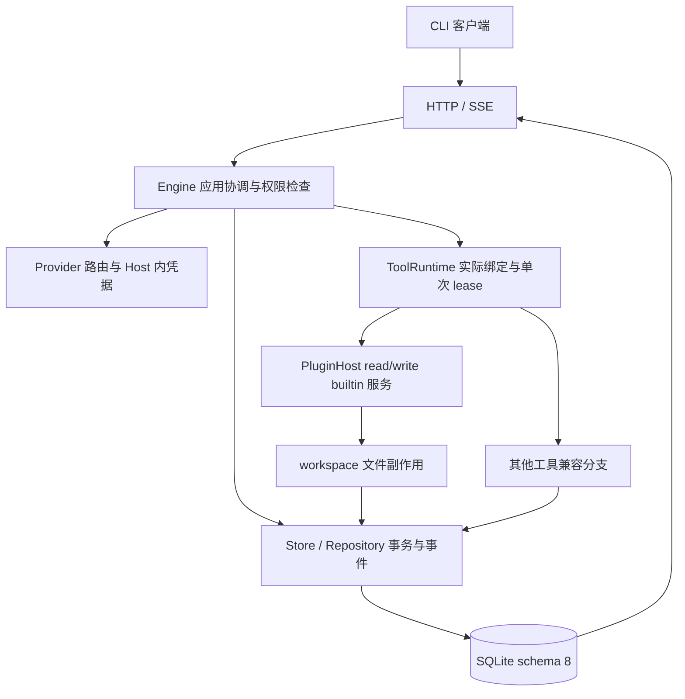

# NoHumanCode 整体项目状态与换对话交接

整理人：项目经理 GPT-6；实际核对时间 2026-09-27T01:23:09+08:00。用户本轮要求整理整体情况、提供新经理提示词以换对话；本轮仅管理交接，没有新产品任务、源码修改或产品测试。本文是截至NEXT-05完成的状态快照；以后有新任务时，以[任务板](../当前任务板.md)、实际Git和最新验收为准。

## 项目定位与总体结论

NoHumanCode是Windows本机AI编程工作台，长期目标为可组合、可撤销、可替换、可审阅、可恢复。稳定Rust Host管理身份、状态、权限、凭据、持久化与生命周期；CLI先证明用户链路，Desktop随后复用协议。产品名称NoHumanCode与源码目录NoManCode不可混淆。

**已完成阶段一的首条单Agent CLI工具开发链路，后端主要安全基础与最小builtin生产装配已整合；完整阶段一和Desktop仍未完成。** 不按代码行数/测试数量估算完成百分比，也不将个人档案轮次等同产品阶段。

## 当前可用链路与分层

图示为职责关系；实际顺序仍是先权限检查/审批、持久claim，再副作用，最后提交可信结果。Provider与兼容工具不因图中出现就被视为已全面插件化。

| 领域 | 已实现且按对应范围验收 | 仍有边界或缺口 |
| --- | --- | --- |
| 身份与持久化 | Project/Session/Agent/Turn/Task稳定ID，幂等、事件、旧Run/Task投影，schema6→7→8保全与结构校验 | 旧数据兼容仍在，不是彻底删除legacy模型；无新schema9 |
| 单Agent会话 | completed单Agent Chat可继承合法工具历史与权限，新Turn/new Task，真实RunContext，恢复后继续 | failed/cancelled/interrupted先走显式旧resume对账，不支持任意会话形状追加 |
| 审批与执行事实 | task+call隔离，参数/工具/任务/工作区/权限绑定，逐次写入/命令审批，claim/finished/unknown，事务与取消竞争 | approved不等于已成功；未知不能自动重试，不承诺外部效果与SQLite分布式恰好一次 |
| 文件变更与恢复 | 受保护before、after摘要、变更事实、冲突预检、稳定restore receipt、partial/unknown、恢复后旧Task写封存 | 限普通文件字节/存在性及当前UTF-8/大小范围；不是Git Diff、目录Checkpoint或命令回滚 |
| 插件基础与生产装配 | Catalog显式版本/依赖/scope；PluginHost Context/effect/生命周期；read/write已接真实payload与可撤销lease | list/search/run_command/run_wasm仍兼容分发；Provider未插件化；WASM/process统一生命周期未接 |
| CLI与HTTP/SSE | project list、run start/list/status/context/events、session status/turns/send/events、task resume/cancel/changes/restore及审批；安全DTO、流式游标 | Host启动配置当前workspace；没有完整项目选择/配置CLI；changes元数据不是文本Diff |
| Provider与凭据 | 既有路由、流式模型调用、并发基础、Host内DPAPI/环境变量凭据，取钥/目标绑定 | 高级KeyPool、预算、持久Scheduler、完整网络授权契约未交付 |
| 前端与扩展 | 旧HTML/JS fallback和Leptos/WASM基础仍保留，原有变更摘要适配 | Desktop完整交互、审批卡片/逐行Diff、完整Team/MCP/Skills不在已完成范围 |

实际用户链路已经验证：连接当前Host工作区 → 创建Chat → 读取真实身份 → 读文件 → 拒绝写入 → 批准写入 → 批准本地检查命令 → 事件/changes → 完整恢复 → 同Session新Turn/Task继续 → 真Host kill/wait后重启查询和继续。测试使用本地确定性Provider，不是付费live模型验收，也不是已发布安装包。

## 架构方向是否偏移

此前[方向自审](../审查记录/2026-09-26项目方向与架构偏移审查.md)指出生产插件装配、CLI完整路径与工具会话衔接滞后，经理已用NEXT-05纠正这三个连接问题。审批、安全恢复与事务基础符合项目宗旨，既有范围验收没有被推翻。

最小read/write装配与completed工具会话衔接已经闭合。完整项目选择、真实Diff/Checkpoint与网络授权仍须交付；不能将它们无限列为“不在本轮范围”而取消项目书要求。继续以用户可审阅的开发链路安排切片，不先扩展Desktop/Team/MCP，也不无限增加与交付无关的安全矩阵。

## 版本与验证锚点

| 项目 | 完整身份或结果 |
| --- | --- |
| 本次整理开始时main HEAD | `1a89f2b81121a2fb2caf107c10d2905868b15c6f`；本次后续只提交交接文档，新经理重新读取实际HEAD |
| 最近产品整合 | `5afa6835673b015186d434eeb26f86fa203bda9e` |
| 最新受测联合候选 | `1a3f3e0840331d54e3419b5826b845d3667feed0` |
| main与受测候选共同Rust tree | `ba569b4e5c4365d5e71a3075ecc7fafe48373bfa` |
| 最新正式验证 | check/test/fmt/clippy/wasm-check全部exit0；303通过、0失败、1付费live忽略 |
| 实际正式验证人/时间 | 员工C GPT-6-astra；2026-09-27 01:03:47—01:06:02 +08:00 |
| 证据 | [联合验收N01～N14](../审查记录/2026-09-27NEXT-05联合验收.md)、[整合记录](../审查记录/2026-09-27NEXT-05整合记录.md)、[C命令账](../../员工C/提交报告/第六轮/C-R6证据/commands.jsonl) |

303是最近固定候选的一次全workspace结果，不能与以前270/233或定向测试相加。本次整理没有重跑上述五门禁，没有推送、发布build或付费live。

已披露限制继续有效：Ctrl+C独立信号未注入；特定并发屏障只证明所安排方向；N09重复claim具体错误类型为源码核对；旧无审批历史用DB形状夹具而非旧二进制真崩溃。真实Host重启及原有崩溃恢复测试存在，不能将所有故障分支都描述为断电实测。上游proc-macro-error2未来兼容提示保留。完整限制见联合验收；本片没有未关闭的产品阻断。

## 人员、模型与工作树

主对话为项目经理，负责方向、契约、分工、review、验收、Git整合与交接；员工负责实现、调试和正式测试。用户已明确授权使用GPT-6-astra员工subagents并行开发，覆盖早期Grok/5.6-sol/6-sol默认安排；历史模型贡献不重写。以后确有模型变更再按用户指令记录，不因服务临时失败静默换模或建立重复任务。

| 人员 | 最近任务与状态 | 保留工作树 / 分支 / 最终组件 |
| --- | --- | --- |
| A | 领域/持久化基础及历史审查已结束；当前无任务 | 后续是否承担实现或独立复核由新契约明确 |
| B | B-R4-01，已验收整合、冻结 | `../nhc-b-tool-turn/` / `codex/b/tool-turn` / `8df22e3664b6d1a773661a2b3879ee2b284ec853` |
| C | C-R6-01，已验收整合、冻结；最终门禁执行者 | `../nhc-c-cli-workflow/` / `codex/c/cli-workflow` / `1a3f3e0840331d54e3419b5826b845d3667feed0` |
| D | D-R3-01及两次只读支持已结束、冻结 | `../nhc-d-tool-runtime/` / `codex/d/tool-runtime` / `3d00f121b0c66124cbb2afc2d6fdf0d1cf504c10` |

开工前如需续接，先查实际代理/文件状态；本次核对三员工均completed，没有活动实现或待审阻断。工具里旧员工最终消息可能早于经理验收，以已落盘的新review/整合为准。旧B-R2-01/B-R3-01等已结项，旧审批/Workspace工作树仍在，不能因为本轮最初聊天提到旧任务就重新执行。

换对话不会自动复制子代理进程或赋予新代理旧任务写权。新任务先登记当前完整基线、契约、唯一写入人、独立工作树及提交/整合人，再按已有并行授权派发；旧任务续接才继承原执行标识。同一任务始终一个当前执行者。报告/身份写共享仓库niuma，禁止误写工作树档案副本。

## 共享工作区需保留的九份在途档案

当前产品源码和index干净；整个仓库不应称“完全干净”，因为以下原有3修改6未跟踪档案仍保持：

1. `niuma/员工B/任务/第二轮/员工B提示词.md`
2. `niuma/员工B/任务/第二轮/审批与Capability网关契约.md`
3. `niuma/项目经理/任务/2026-09-25NEXT-02C审批网关任务包.md`
4. `niuma/员工B/任务/第二轮/员工B提示词-安全补充修订2.md`
5. `niuma/员工B/任务/第二轮/审批网关契约补充修订2.md`
6. `niuma/员工C/任务/第三轮/审批HTTP契约草案.md`
7. `niuma/项目经理/任务/2026-09-25审批契约接续与HTTP草案.md`
8. `niuma/项目经理/审查记录/2026-09-25NEXT-02C契约补充审查.md`
9. `niuma/项目经理/提交报告/2026-09-25接任与审批契约收口.md`

本机哈希基准`.local/review-evidence/Workspace-before-main-kept-20260926.json`仍有效；该忽略目录不保证随其他克隆提供，缺失时如实登记不能编造已核哈希。不得reset/clean/stash、覆盖、顺手暂存或清理这些档案及旧工作树。共享index由经理操作，员工只提交授权独立树源码。

## 下一位经理的第一份具体交付

1. 核对最新main/源码tree、任务板及本快照。当前没有新任务已派发；不要重做NEXT-05或把本次交接当新源码授权单。
2. 读取既有Workspace/approval契约与实际接口，制定**真实Git Diff/最小Checkpoint**切片：先明确需要哪些只读审阅能力、基准与路径范围、Git/非Git工作区处理，再界定Checkpoint与现有安全restore的关系。网络权限/新副作用、schema变更和跨模块接口必须写进契约。
3. 契约必须决定而非含糊带过：未跟踪/暂存文件、二进制/大文件/重命名、并发外部编辑和冲突、秘密内容展示、Checkpoint身份与恢复代次。经理可选择有界首片，但要说明未覆盖项的后续安排；不能用changes清单冒充Diff，也不能把checkpoint默认为Git commit/reset操作。
4. 明确模型网络、显式网络工具、命令内网络的不同授权边界及多项目配置优先级，保留现行取钥/目标绑定；不能声称已有OS网络沙箱或默默要求每个模型请求弹窗。
5. 写出可审阅契约、验收矩阵和唯一文件所有权，再按用户既有授权派GPT-6-astra员工并行实现。经理不直接代写产品，不必等待重复形式确认；若模型/工具不可用，保全现场、明确限制并继续独立可做事项。

这五项是下一步方向与管理工作顺序，尚无NEXT-06固定API、任务ID或源码写权。最终契约由新经理基于实际代码决定，避免未经核对冻结方案。首片完成后仍先评估阶段一缺口，不自动进入Desktop。

## 新对话入口及本次验证

复制根[新经理提示词](../../../项目经理启动提示词.md)，从[根交接入口](../../../HANDOFF-TO-NEXT-MODEL.md)→[经理启动说明](../启动说明.md)接手。新经理无需通读完整历史聊天；当前身份/任务板→本快照→最新联合验收/整合→相关源码即可定位，再按需追溯旧报告。

本次实际检查：Git HEAD/tree/status/worktree、员工completed状态、相关API定位与现行报告。首次源码搜索使用PowerShell不支持的花括号路径导致命令解析exit1，改显式文件列表后exit0；这是经理只读命令错误，不是产品测试失败。文档链接、九继承哈希、源码不变和diff whitespace在提交前核验。本轮不运行无关产品测试、不派员工实现、不清理或发布。

提交前验证结果：50个相关Markdown链接存在，新增交接内容无本机绝对路径，九继承档案SHA-256全部保持，产品源码diff为空且Rust tree不变；Python校验和diff whitespace检查exit0。
